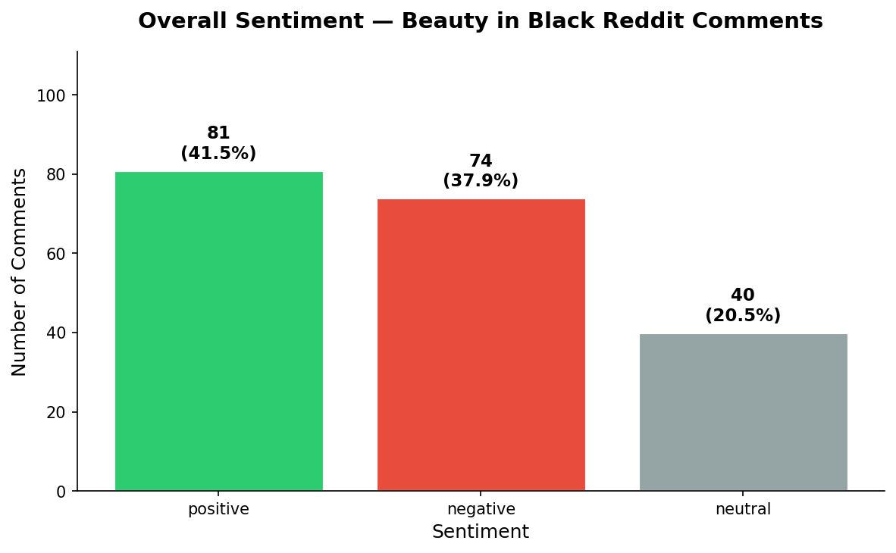
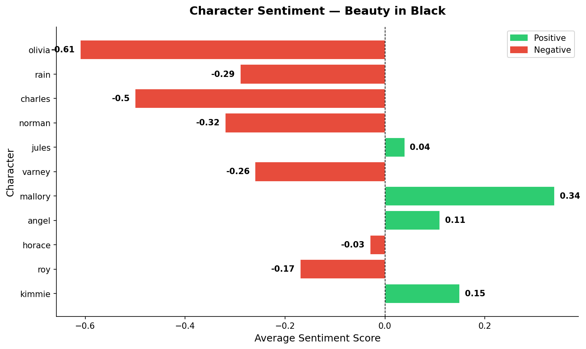
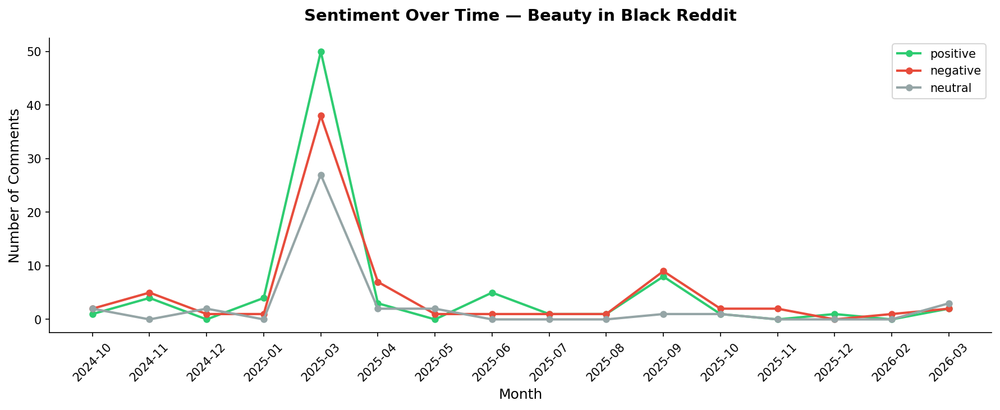
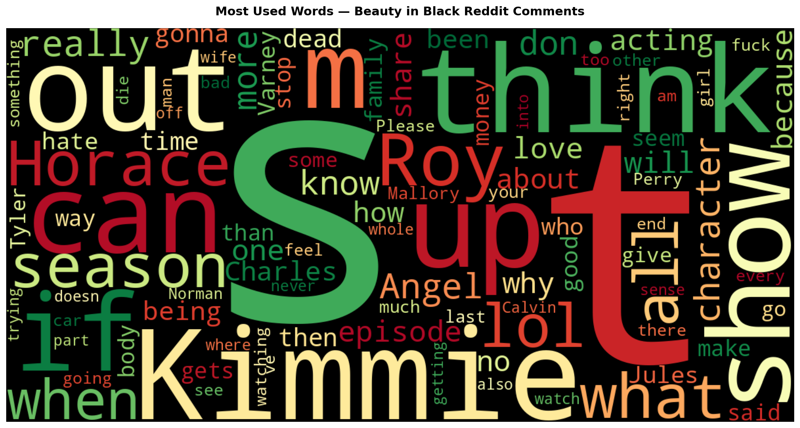

# 🎬 Beauty in Black — Reddit Sentiment Analysis

A data pipeline that scrapes, cleans, and analyzes Reddit opinions about Tyler Perry's **Beauty in Black** (Netflix) using Python, SQL, and VADER sentiment analysis.

---

## 📊 Key Findings

- **45%** of Reddit comments are positive about the show
- **Mallory** is the most positively discussed character (+0.34)
- **Olivia** is the most negatively discussed character (-0.61)
- **Kimmie** dominates discussions with 31 mentions — highest of any character
- **Roy and Varney** are the most disliked characters among fans

---

## 📈 Charts

### Overall Sentiment Breakdown


### Character Sentiment Analysis


### Sentiment Over Time


### Most Used Words


---

## 🛠️ Tech Stack

- **Python** — scraping, cleaning, sentiment analysis
- **VADER** — sentiment scoring (no ML training needed)
- **SQLite + DBeaver** — data filtering and querying
- **Pandas** — data manipulation
- **Matplotlib + Seaborn** — visualizations
- **WordCloud** — word frequency visualization

---

## 📁 Project Structure
```
reddit-scraper/
│
├── scraper/
│   ├── beauty_in_black_scraper.py   ← Reddit scraper
│   ├── beauty_in_black_cleaner.py   ← text cleaning
│   └── sentiment_beauty_in_black.py ← VADER sentiment
│
├── charts/
│   ├── overall_sentiment.png
│   ├── character_sentiment.png
│   ├── sentiment_over_time.png
│   └── wordcloud.png
│
├── data/
│   ├── raw/                         ← original scraped data 🔒
│   └── clean/                       ← processed data ✅
│
├── queries.sql                      ← all SQL work
├── beauty_in_black.db               ← SQLite database
└── README.md
```

---

## ⚙️ How to Run
```bash
# 1. Clone the repo
git clone https://github.com/Delphineuzoeto/reddit-scrape

# 2. Install dependencies
pip install -r requirements.txt

# 3. Scrape Reddit data
python scraper/beauty_in_black_scraper.py

# 4. Clean the data
python scraper/beauty_in_black_cleaner.py

# 5. Run sentiment analysis
python scraper/sentiment_beauty_in_black.py

# 6. Generate charts
python charts/visualize_bib.py
```

---

## ⚠️ Limitations

- VADER reads words literally — context and sarcasm can affect accuracy
- Reddit data skews toward engaged fans, not casual viewers
- Small dataset (195 comments) — Twitter analysis coming in v2

---

## 🔮 Next Steps

- Add Twitter/X data for broader sentiment coverage
- Build interactive dashboard with Streamlit
- Expand to compare multiple Tyler Perry shows
- Apply to streaming wars analysis (Netflix vs Showmax vs Prime)

---

## 👩‍💻 Author

Built by **Delphine** — data analyst learning in public 🚀

